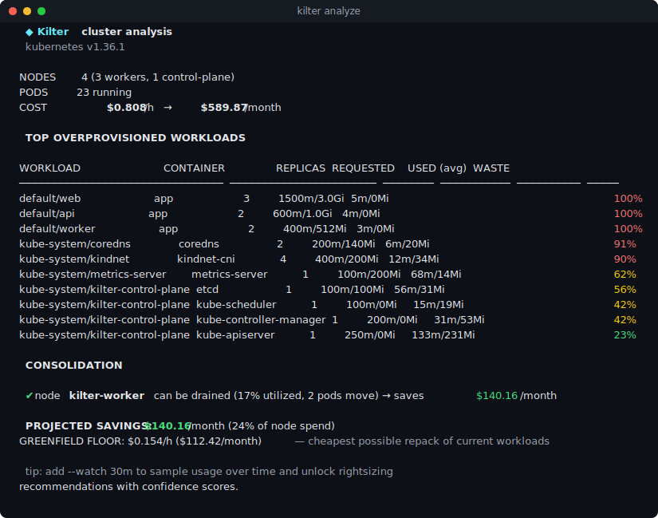
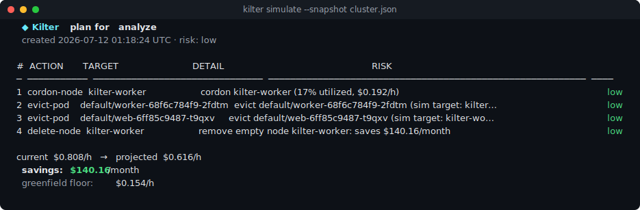

<div align="center">

# ◆ Kilter

**Keep your Kubernetes clusters in kilter.**

Self-hosted, single-binary cluster cost optimization — learn workload behavior,
rightsize every container, and safely bin-pack nodes away.
An open-source alternative to CAST AI, ScaleOps and PerfectScale that runs entirely in **your** infrastructure.

[](https://github.com/agenticode/kilter/actions/workflows/ci.yaml)
[](https://goreportcard.com/report/github.com/agenticode/kilter)
[](LICENSE)
[](go.mod)




*Real output: a 4-node kind cluster analyzed in two seconds — $140/month of savings found, PDB-safe.*

</div>

---

## Why Kilter

Most clusters run at **10–30% of requested capacity**. Commercial optimizers fix
that by shipping your cluster topology to their SaaS and charging a share of the
savings. Kilter does the same control loop — **observe → learn → decide → act** —
as a single Apache-2.0 binary you run yourself:

| | |
|---|---|
| 🧠 **Central brain, your infra** | One brain optimizes many clusters. Air-gapped friendly: no data leaves your network, no per-cluster SaaS bill. |
| ⚡ **Zero-install analyze** | `kilter analyze` + any kubeconfig = instant cost, waste and savings report. No agents, read-only. |
| 📐 **VPA-grade rightsizing** | Decaying-histogram percentiles per container (CPU p95, memory peak), OOM-aware floors, HPA interplay handled, confidence scores. |
| 📦 **Safe bin-packing** | A real scheduling simulator (taints, affinity, anti-affinity, topology spread, PDBs, DaemonSet overhead) proves every pod fits **before** a node is touched. |
| 🛡️ **Safety envelope** | Dry-run by default. PDB reservations, eviction budgets, cooldowns, cluster headroom floor, and automatic revert when a change causes OOM/crashloop. |
| 🔁 **In-place resize** | On Kubernetes ≥1.33, resizes land on running pods without restarts. |
| 🧪 **Deterministic simulator** | `kilter simulate` replays any recorded snapshot through the exact production decision path. Review the plan in CI before it ever runs. |
| 🤖 **Self-learning AIOps loop** | Online pattern classifier (steady/diurnal/bursty/batch/growing) adapts sizing policy per workload — and re-adapts when behavior changes. Every decision states its evidence. |
| 🔮 **Predictive insights** | `kilter insights`: OOM-risk ETAs, CPU saturation, 24h capacity-exhaustion forecasts. Plug pre-trained foundation models (Chronos, TimesFM) via `--forecaster-url`; built-ins are the fallback. |
| 🤝 **Karpenter & KEDA native** | Karpenter-managed nodes are left to Karpenter — Kilter's rightsizing feeds its consolidation. KEDA-driven HPAs are detected and respected. |
| ☁️ **Node lifecycle providers** | `--provider eks` terminates drained instances via ASG APIs (decrement-aware); `webhook` for on-prem/any-cloud; `karpenter` semantics built in. Freed capacity actually stops billing. |
| 💸 **Spot automation** | Spot-safety scoring per workload with $ estimates; emergency drains on interruption signals (NTH/Karpenter taints) — cooldowns bypassed, PDBs still enforced. |
| 🏷️ **Live pricing** | `kilter pricing sync-aws` builds catalogs from the AWS Pricing API + current spot prices. Embedded baseline works offline. |
| 🖥️ **Built-in dashboard** | The brain serves a zero-dependency web UI at `/ui`: cost, savings, insights, recommendations, plans. Read-only tokens for viewers. |
| 🎮 **GPU-aware** | Extended resources (nvidia.com/gpu, …) gate every simulated placement — GPU nodes are never drained without replacement capacity. |
| 🚦 **Guardrails & approvals** | `kilter.dev/mode` annotations (off/recommend/apply) per workload or namespace, change windows, a one-annotation freeze switch, and `--require-approval` with plan fingerprints — humans stay in charge. |
| 🧾 **Verifiable savings ledger** | Every executed plan is recorded with claimed vs *measured* cost, formula included. `kilter undo` reverts the latest applied plan. No marketing math. |
| ⛔ **Circuit breaker** | NotReady/Pending surges pause all automation — a struggling cluster is observed, never optimized into an outage. |
| 📊 **Prometheus-native** | Cost, savings and learning metrics exposed; Grafana dashboard included. |

## Quick start

### 1. Instant report (nothing installed in the cluster)

```console
$ go install github.com/agenticode/kilter/cmd/kilter@latest   # or grab a release binary
$ kilter analyze
```

That's the screenshot above. Add `--watch 30m` to sample usage over time and
unlock per-container rightsizing recommendations with confidence scores, or
`--json` for machines.

### 2. Full loop (Helm)

```console
$ helm install kilter charts/kilter --namespace kilter --create-namespace
```

That deploys three small components:

```
      ┌───────────────────────────────────────────┐
      │                BRAIN (central)            │
 push │   learn (histograms) → recommend → plan   │ pull
┌─────┴────┐                                 ┌────┴───────┐
│  AGENT   │                                 │ CONTROLLER │
│ collects │                                 │  executes  │
└────┬─────┘                                 └────┬───────┘
     │ watch + metrics.k8s.io        cordon/evict │ resize
     ▼                                            ▼
 ──────────────────  Kubernetes cluster  ──────────────────
```

The controller ships in **dry-run**: it logs every step it *would* take. Read
the logs for a day, then flip to apply:

```console
$ helm upgrade kilter charts/kilter -n kilter --set controller.mode=apply
```

Point agents from any number of clusters at one brain
(`--set brain.externalURL=… --set clusterID=prod-eu`) for fleet-wide optimization.

### 3. Review decisions offline

```console
$ kilter analyze --dump-snapshot cluster.json
$ kilter simulate --snapshot cluster.json        # exact same decision engine, zero cluster access
```

<div align="center"></div>

## What it does

1. **Agent** snapshots topology (nodes, pods, workloads, PDBs, HPAs) and usage
   (`metrics.k8s.io`) every minute and pushes to the brain.
2. **Brain** feeds usage into exponentially-decaying histograms per container —
   24h half-life, so it tracks workload evolution without forgetting spikes —
   and classifies each workload's behavior online (steady / diurnal / bursty /
   batch / growing), adapting percentile and headroom per class (see
   [docs/forecasting.md](docs/forecasting.md)).
   From those it derives **requests** (CPU p95 × headroom; memory peak with
   OOM-bumped floors) and builds a **plan**: resize steps first, then node
   consolidation proven safe by the built-in scheduling simulator, with the
   dollar impact of every step.
3. **Controller** executes plans: patch → cordon → evict (through the eviction
   API, so PDBs are enforced twice) → delete, watching every changed workload
   afterwards and reverting anything that regresses.

The full decision engine is pure Go with zero Kubernetes dependencies —
unit-tested in milliseconds, fuzzable, and reused verbatim by `analyze`,
`simulate`, the brain, and the e2e suite. See [ARCHITECTURE.md](ARCHITECTURE.md).

Read [docs/trust.md](docs/trust.md) for the full trust package: guardrails,
change windows, circuit breaker, approvals, the verifiable ledger, and undo.

## Safety model

Kilter treats disruption as a budget, not a side effect:

- **PodDisruptionBudgets** are honored at plan time (reservations, so one plan
  can't overspend a budget) *and* at execution time (eviction API).
- Pods that are not Kilter's to move — bare pods, local storage,
  `kilter.dev/do-not-evict`, `safe-to-evict=false` — pin their nodes.
- Node removals require every displaced pod to **provably reschedule** under
  full constraint semantics, and the surviving cluster keeps a configurable
  headroom floor (default 10%).
- Sliding eviction budget (default 20/hour), per-workload cooldowns, bounded
  removals per plan (default 3), control-plane nodes never touched.
- **Regression revert**: OOMKill or crashloop within 30 minutes of a Kilter
  change → automatic rollback + 24h quarantine for that workload.
- Failed node surgery **aborts the plan** — never evict-and-hope.

## Benchmarks

Decision latency on an M4 laptop (see `make bench`):

| Operation | Scale | Time |
|---|---|---|
| Drain simulation (full constraint check) | 1,000 nodes / 10,000 pods | **~3 ms** |
| Cheapest-node-set plan from scratch | 10,000 pods × 20 instance types | **~0.4 s** |
| Full rebalance plan (soak test in CI) | 5,000 nodes / 45,000 pods | **~1.6 s** |
| Recommender snapshot ingest | 45,000 usage samples | **~12 ms** |
| Histogram sample ingest | per sample | **~100 ns** |

## Kilter vs. alternatives

| Capability | Kilter | CAST AI | Kubecost/OpenCost | VPA | Karpenter |
|---|---|---|---|---|---|
| Self-hosted / air-gapped | ✅ | ❌ SaaS | ✅ | ✅ | ✅ |
| Cloud node termination (stop billing) | ✅ EKS/webhook | ✅ | ❌ | ❌ | ✅ |
| Spot safety scoring + interruption drains | ✅ | ✅ | ❌ | ❌ | partial |
| Cost visibility | ✅ | ✅ | ✅ | ❌ | ❌ |
| Rightsizing (learned) | ✅ | ✅ | 📊 report-only | ✅ | ❌ |
| Node consolidation with scheduling proof | ✅ | ✅ | ❌ | ❌ | ✅* |
| Multi-cluster central brain | ✅ | ✅ | 💰 paid | ❌ | ❌ |
| Offline decision replay | ✅ | ❌ | ❌ | ❌ | ❌ |
| Automatic regression revert | ✅ | ❌ | ❌ | ❌ | ❌ |
| Predictive OOM / capacity insights | ✅ | partial | ❌ | ❌ | ❌ |
| Pluggable foundation-model forecasts | ✅ | ❌ | ❌ | ❌ | ❌ |
| Verifiable (measured) savings ledger | ✅ | ❌ self-reported | partial | ❌ | ❌ |
| Human approval gate + undo | ✅ | partial | ❌ | ❌ | ❌ |
| Annotation guardrails + freeze switch | ✅ | partial | ❌ | partial | ✅ |
| Price | Apache-2.0 | % of savings | free/paid | free | free |

\* Karpenter consolidates nodes it provisioned; Kilter works on any cluster,
including on-prem — and they compose: Kilter rightsizes requests, Karpenter
provisions for the corrected shapes.

## Configuration

Everything meaningful is a flag (or env var) with a production default:

| Flag | Default | What it does |
|---|---|---|
| `controller --mode` | `dry-run` | `apply` mutates; dry-run only logs |
| `controller --max-evictions-per-hour` | `20` | sliding disruption budget |
| `brain --db` | `kilter.db` | bbolt state (learning survives restarts) |
| `analyze --watch` | off | sample for a duration → confident recommendations |
| `--catalog` | embedded | custom instance pricing JSON (on-prem, discounts) |
| node annotation `kilter.dev/hourly-cost` | — | exact per-node price override |
| pod annotation `kilter.dev/do-not-evict` | — | opt a pod out of consolidation |

Pricing resolution: node annotation → embedded/custom catalog (AWS/GCP/Azure,
spot-aware, burstable-aware) → resource-based fallback. Relative savings stay
meaningful even before you tune prices.

## Observability

The brain exposes `/metrics`: `kilter_cluster_cost_hourly_usd`,
`kilter_plan_savings_monthly_usd`, `kilter_recommendations`,
`kilter_tracked_containers`, ingest counters/latency. Import
[`dashboards/kilter-grafana.json`](dashboards/kilter-grafana.json).

## Development

```console
$ ./test.sh        # gofmt + vet + race tests + build (runs in <30s)
$ make bench       # decision-engine benchmarks
$ ./test/e2e/e2e.sh  # full loop against a kind cluster it creates itself
```

The e2e suite creates a 4-node kind cluster, deploys overprovisioned demo
workloads, and asserts the whole story: analyze finds savings → simulate
reproduces the decision offline → agent/brain converge → controller **actually
consolidates the cluster** and every workload stays Running.

## Status & roadmap

Kilter is young and moving fast. Shipped: everything above. Next:

- GKE/AKS node-group providers (EKS + generic webhook shipped; the interface is three methods)
- Provision-before-drain surge rebalancing on non-Karpenter clusters
- GCP/Azure live pricing sync (AWS shipped)
- Forecast-driven pre-scaling actions (the capacity forecasts already exist as insights)
- Workload placement mutation for spot (scoring shipped; automated migration next)

Issues and PRs welcome. Read [ARCHITECTURE.md](ARCHITECTURE.md) first; the
decision engine is deliberately dependency-free and a joy to test.

## License

[Apache 2.0](LICENSE)
